<h1 id="dehaze-GAN"> dehaze-GAN</h1>

*   [演算法說明](#Algo)
    *   [除霧架構](#Architecture)
    *   [生成器](#generator)
    *   [分辨器](#discriminator)
    *   [training epoachs](#training-epoachs)
*   [使用方法](#howtouse)
    *   [訓練](#training)
    *   [測試](#testing)
    *   [圖片除霧](#images_test)
    *   [影片除霧](#video_test)
*   [結果展示](#result)
    *   [圖片除霧結果](#images_result)
    *   [影片除霧結果](#video_result)

<h2 id="Algo"> 演算法說明</h2>
<h3 id="Architecture"> 除霧架構</h3>


<h3 id="generator"> 生成器</h3>

| Unet1 | Unet2 |
| --- | --- |
|  |  |

<h3 id="discriminator"> 分辨器</h3>


<h3 id="training-epoachs"> training epoachs</h3>


<h2 id="howtouse"> 使用方法</h2>

<h3 id="training"> 訓練</h3>

```sh
python main.py --phase train --pretrain (True or False) --weights_path ./weights_dir/weights.ckpt --dataset_path_x ./dataset_x.npy --dataset_path_y ./dataset_y.npy  --output_dir ./output/
```
<h3 id="testing"> 測試</h3>

```sh
python main.py  --phase test --pretrain True --weights_path ./weights_dir/weights.ckpt --dataset_path_x ./dataset_x.npy --dataset_path_y ./dataset_y.npy  --output_dir ./output/
```
<h3 id="images_test"> 圖片除霧</h3>

```sh
python main.py  --phase images --pretrain True --weights_path ./weights_dir/weights.ckpt --imlist ["./sample1.jpg","./sample2.png"] --output_dir ./output/
```
<h3 id="video_test"> 影片除霧</h3>

```sh
python main.py  --phase video --pretrain True --weights_path ./weights_dir/weights.ckpt --video_path ./video.avi --output_dir ./output/
```

<h2 id="result"> 結果展示</h2>

<h3 id="images_result"> 圖片除霧結果</h3>

| input | output | input | output |
| --- | --- | --- | --- |
|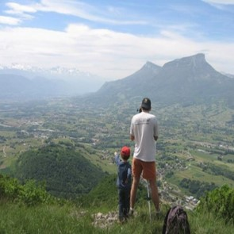|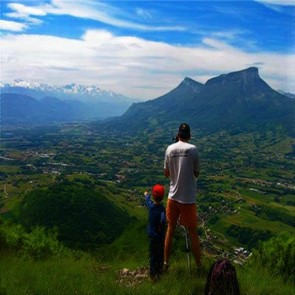|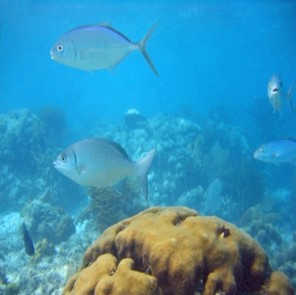|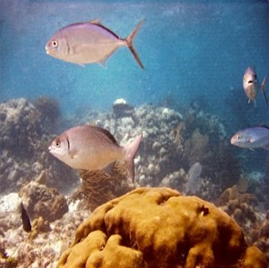|
|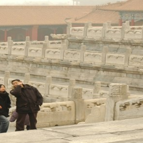|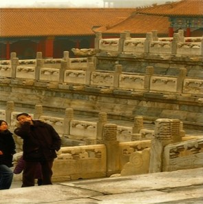|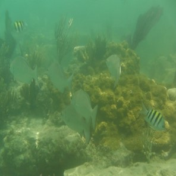|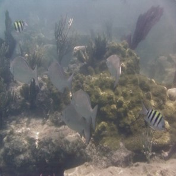|
|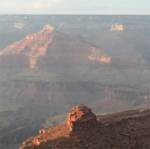|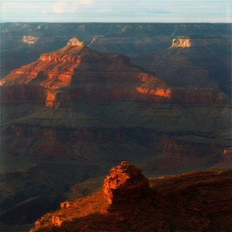|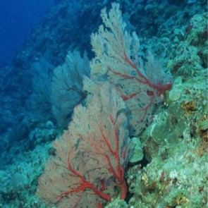|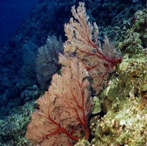|
|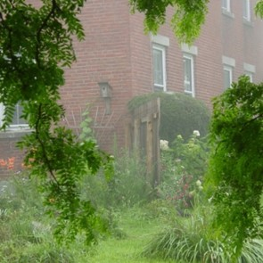||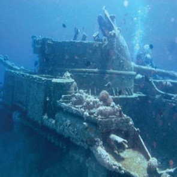|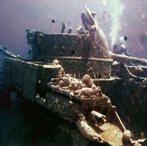|
|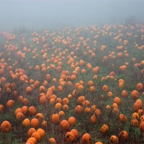|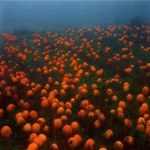|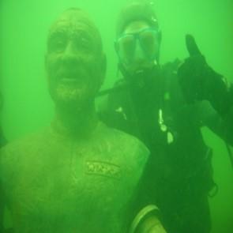|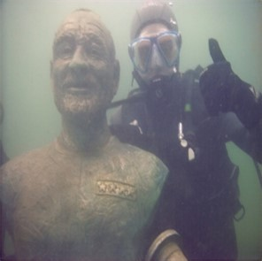|
|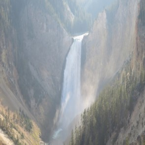|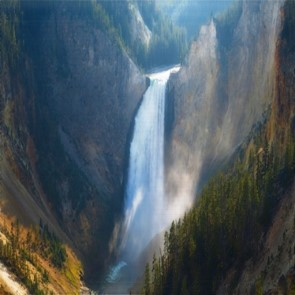|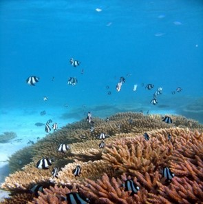|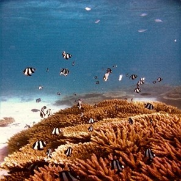|

<h3 id="video_result"> 影片除霧結果</h3>

