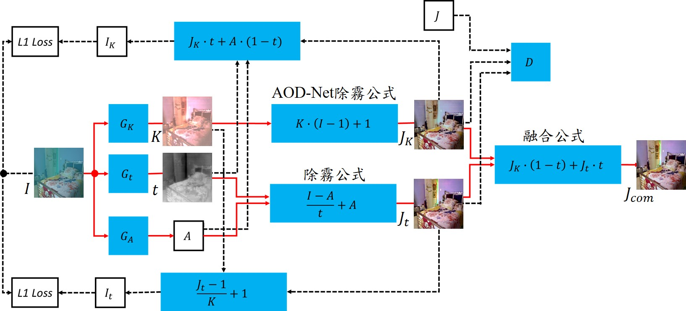
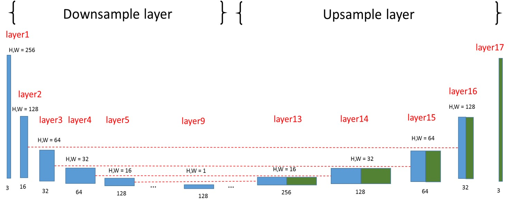
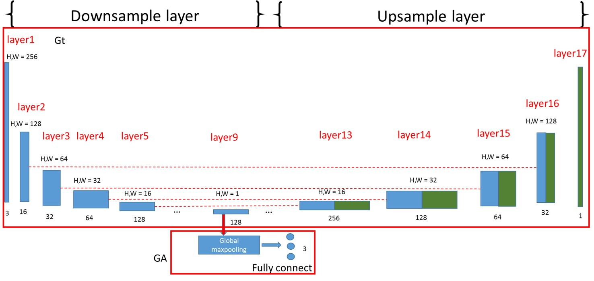
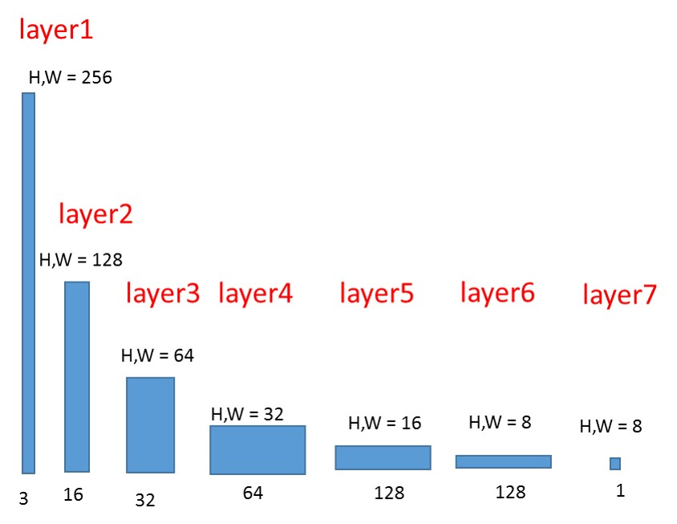

<h1 id="dehaze-GAN"> dehaze-GAN</h1>

*   [演算法說明](#Algo)
    *   [除霧架構](#Architecture)
    *   [生成器](#generator)
    *   [分辨器](#discriminator)
    *   [training epoachs](#training-epoachs)
*   [使用方法](#howtouse)
    *   [訓練](#training)
    *   [測試](#testing)
    *   [圖片除霧](#images_test)
    *   [影片除霧](#video_test)

<h2 id="Algo"> 演算法說明</h2>
<h3 id="Architecture"> 除霧架構</h3>


<h3 id="generator"> 生成器</h3>

| Unet1 | Unet2 |
| --- | --- |
|  |  |

<h3 id="discriminator"> 分辨器</h3>


<h3 id="training-epoachs"> training epoachs</h3>


<h2 id="howtouse"> 使用方法</h2>

<h3 id="training"> 訓練</h3>

```sh
python
```
<h3 id="testing"> 測試</h3>

```sh
python
```
<h3 id="images_test"> 圖片除霧</h3>

```sh
python
```
<h3 id="video_test"> 影片除霧</h3>

```sh
python
```

(TODO  Not finish)
利用GAN來進行除霧
 *A*
 **B**
 ***C***

[abc](https://github.com/phillipi/pix2pix)

## Setup
### Prerequisites
```sh
# python
```

| dataset | example |
| --- | --- |
| aa | bb |

The following models have not been implemented:
- defineG_encoder_decoder
- defineG_unet_128
- defineD_pixelGAN


```
@article{pix2pix2016,
  title={Image-to-Image Translation with Conditional Adversarial Networks},
  author={Isola, Phillip and Zhu, Jun-Yan and Zhou, Tinghui and Efros, Alexei A},
  journal={arxiv},
  year={2016}
}
```

## Acknowledgments
This is a port of [pix2pix](https://github.com/phillipi/pix2pix).

[tmp](#dehazed-GAN)

ax^{2} + by^{2} + c = 0


